# Current Space Management Analysis

## Overview

The current implementation uses an in-place update strategy with a free space tracking system.

### File Structure

1. **File Headers** (13 bytes):
   - Byte 0: Max key length
   - Bytes 1-4: Number of records (int)
   - Bytes 5-12: Data start pointer (long)

2. **Index Region**: Contains record headers for all keys
   - Each entry: key (with length prefix + CRC32) + RecordHeader (20 bytes)
   - Can expand by moving data records

3. **Data Region**: Contains actual record data
   - May have gaps from deletions/updates

### In-Memory Data Structures

- `HashMap<ByteSequence, RecordHeader> memIndex` - O(1) key lookup
- `TreeMap<Long, RecordHeader> positionIndex` - Records indexed by file position
- `ConcurrentSkipListMap<RecordHeader, Integer> freeMap` - Free space sorted by size (ascending)

### RecordHeader Structure
```
long dataPointer;      // 8 bytes - file position
int dataCapacity;      // 4 bytes - allocated space
int dataCount;         // 4 bytes - actual data length
int crc32;            // 4 bytes - header checksum
int indexPosition;     // position in index (not written to file)
```

## Operation Cases Summary

### INSERT Operation Cases
- **Insert - File Empty**: Initial insert when file is empty or only has space for index
- **Insert - Gap Available**: Space available between index and data start
- **Insert - Free Space Available**: Existing record has free space that can be reused
- **Insert - Append to End**: No suitable free space, must expand file
- **Insert - Index Expansion Required**: Index region is full, must move records

### UPDATE Operation Cases
- **Update - In Place (Same Size)**: New data fits exactly in old space
- **Update - In Place (Smaller, CRC Enabled)**: New data smaller, CRC32 checks enabled
- **Update - Last Record Resize**: Record is at end of file, can expand/contract
- **Update - Move Required (Grows)**: Record grows, must allocate new space

### DELETE Operation Cases
- **Delete - Last Record**: Record is at end of file, can shrink file
- **Delete - Last in Index**: Record header is last in index, overwrite with final entry
- **Delete - Middle Record**: Record in middle, merge free space with adjacent record

## INSERT Operations

### Insert - Gap Available

**Scenario**: Space is available between the end of the index region and the start of the data region.

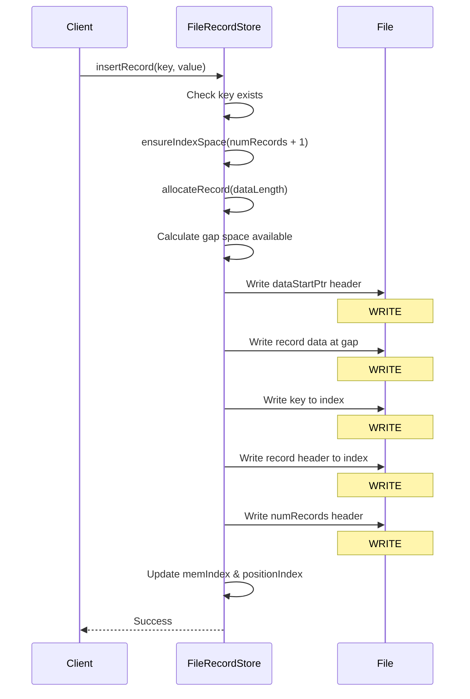

**Steps**:
1. Check if key already exists (throw exception if it does)
2. Ensure index has space for new entry
3. Calculate space needed with padding
4. Calculate available gap: `dataStart - endIndexPtr - (2 * indexEntryLength)`
5. **WRITE #1**: Update dataStartPtr header to shrink gap
6. **WRITE #2**: Write length + data + CRC32 at new position in gap
7. **WRITE #3**: Write key length + key bytes + CRC32 to index
8. **WRITE #4**: Write RecordHeader (dataPointer, capacity, count, CRC) to index
9. **WRITE #5**: Write incremented numRecords to file header
10. Update in-memory maps (memIndex, positionIndex)

**Write Count**: 5 writes

---

### Insert - Free Space Available

**Scenario**: An existing deleted or updated record has free space that can be reused.

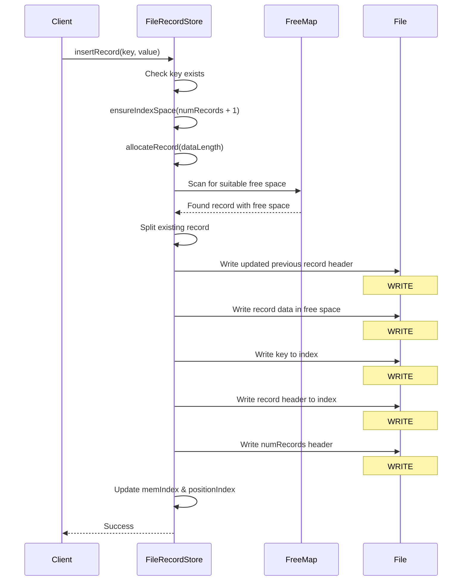

**Steps**:
1. Check if key already exists
2. Ensure index has space for new entry
3. Calculate space needed with padding
4. Search freeMap (ConcurrentSkipListMap sorted by size) for first fit
5. Find record with sufficient free space: `getFreeSpace() >= dataLengthPadded`
6. Split the record: create new header at `dataPointer + dataCount + padding`
7. **WRITE #1**: Update previous record header (shrink its capacity)
8. **WRITE #2**: Write length + data + CRC32 at split position
9. **WRITE #3**: Write key to index
10. **WRITE #4**: Write new RecordHeader to index
11. **WRITE #5**: Write incremented numRecords
12. Update in-memory maps and freeMap

**Write Count**: 5 writes

---

### Insert - Append to End

**Scenario**: No free space available anywhere, must expand file and append.

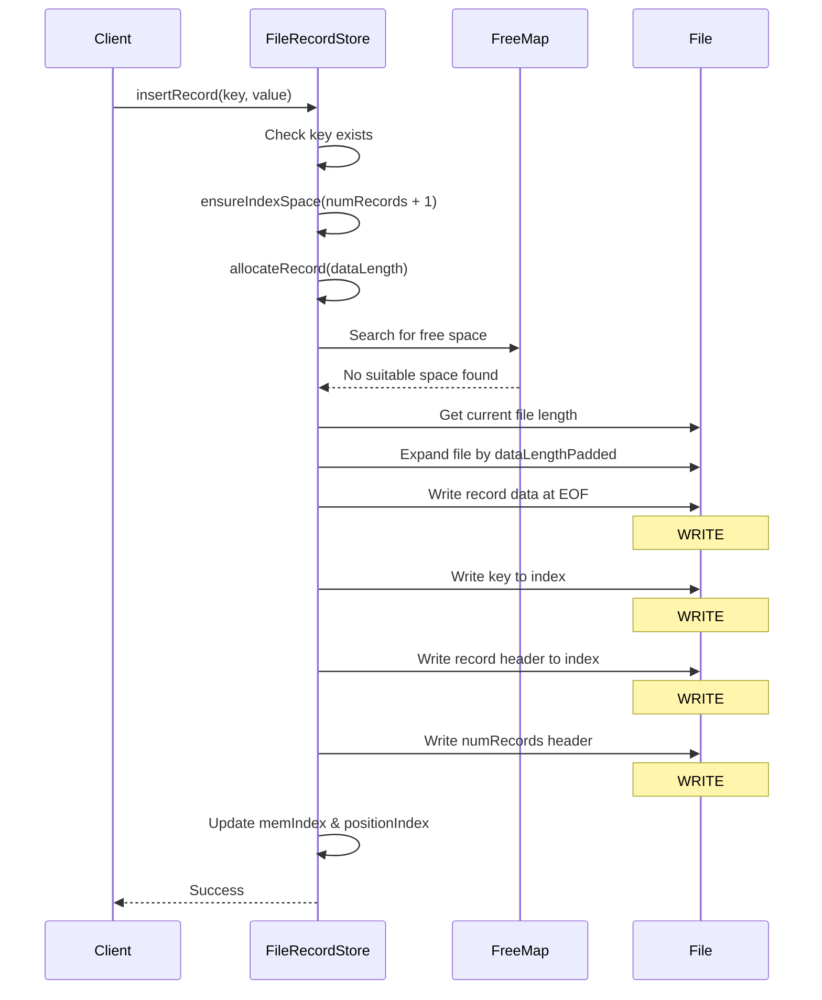

**Steps**:
1. Check if key already exists
2. Ensure index has space for new entry
3. Calculate space needed with padding
4. Check gap between index and data start: not enough
5. Search freeMap for suitable space: none found
6. Get current file length (EOF position)
7. Expand file: `setFileLength(fileLength + dataLengthPadded)`
8. **WRITE #1**: Write length + data + CRC32 at EOF
9. **WRITE #2**: Write key to index
10. **WRITE #3**: Write RecordHeader to index
11. **WRITE #4**: Write incremented numRecords
12. Update in-memory maps

**Write Count**: 4 writes

---

### Insert - Index Expansion Required

**Scenario**: Index region is full and needs to expand by moving data records to end of file.

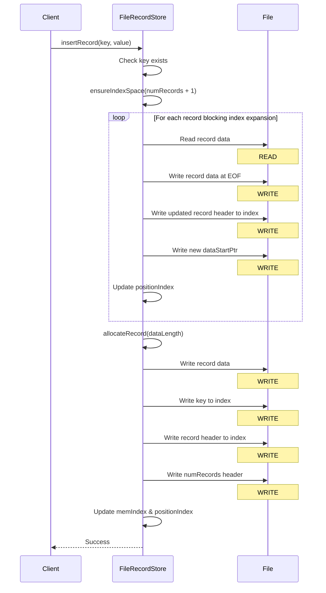

**Steps**:
1. Check if key already exists
2. Call `ensureIndexSpace(numRecords + 1)`
3. Calculate required index end pointer: `FILE_HEADERS + (numRecords * indexEntryLength)`
4. While `endIndexPtr > dataStartPtr` (index needs more space):
   - **READ**: Read first record at dataStartPtr
   - Get file length (EOF)
   - **WRITE #1**: Write record data at EOF (moved)
   - **WRITE #2**: Write updated RecordHeader to index (new position)
   - Update dataStartPtr to next record position
   - **WRITE #3**: Write new dataStartPtr to file header
   - Update positionIndex with new location
   - Repeat for next blocking record (3 writes per moved record)
5. After index expansion, perform normal insert:
   - **WRITE #N**: Write record data
   - **WRITE #N+1**: Write key to index
   - **WRITE #N+2**: Write record header to index
   - **WRITE #N+3**: Write numRecords
6. Update in-memory maps

**Write Count**: 3N + 4 writes (where N = number of records moved)

---

## UPDATE Operations

### Update - In Place (Same Size)

**Scenario**: New data is exactly the same size as the old data.

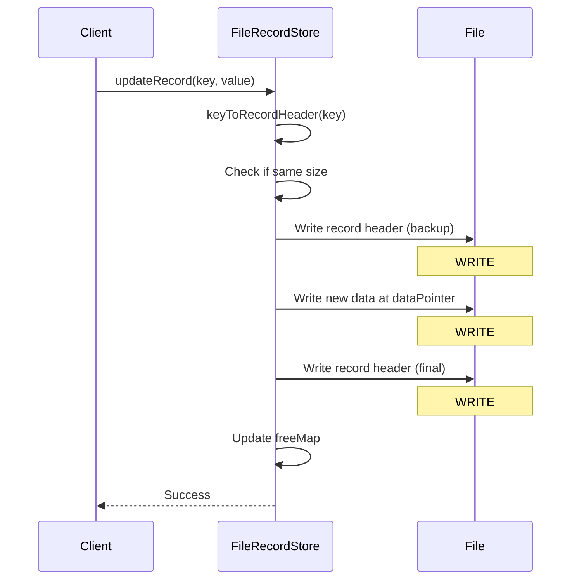

**Steps**:
1. Get existing RecordHeader from memIndex using key
2. Check if `value.length == header.dataCapacity`
3. **WRITE #1**: Write existing header to index (backup for crash safety)
4. Update dataCount in memory
5. **WRITE #2**: Write length + new data + CRC32 at dataPointer
6. **WRITE #3**: Write header again with updated CRC (final)
7. Update freeMap if free space changed

**Write Count**: 3 writes

---

### Update - In Place (Smaller, CRC Enabled)

**Scenario**: New data is smaller and CRC32 is enabled (allows safe in-place shrink).

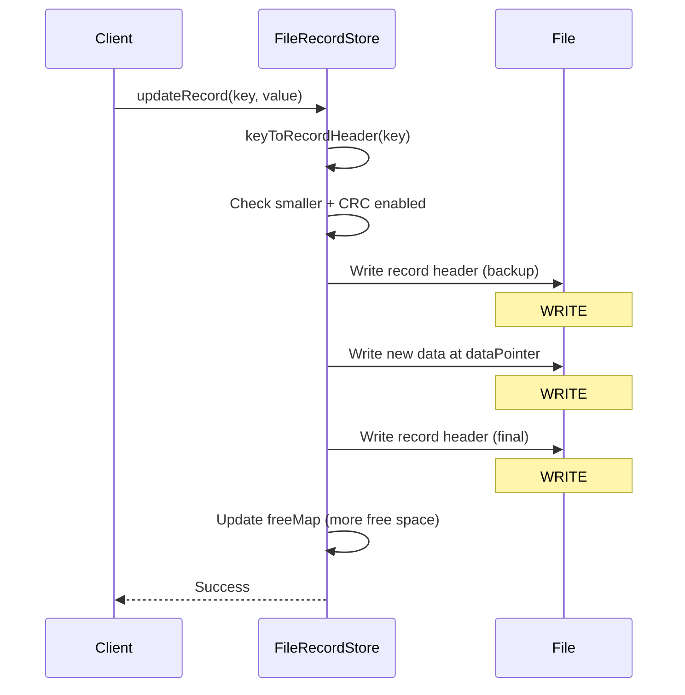

**Steps**:
1. Get existing RecordHeader from memIndex
2. Check if `!disableCrc32 && value.length < header.dataCapacity`
3. **WRITE #1**: Write current header (backup)
4. Update dataCount to new smaller size
5. **WRITE #2**: Write length + new data + CRC32 at dataPointer (leaves free space after)
6. **WRITE #3**: Write header with new CRC
7. Update freeMap with increased free space: `dataCapacity - (dataCount + overhead)`

**Write Count**: 3 writes

---

### Update - Last Record Resize

**Scenario**: Record is at the end of the file, can expand or contract by changing file length.

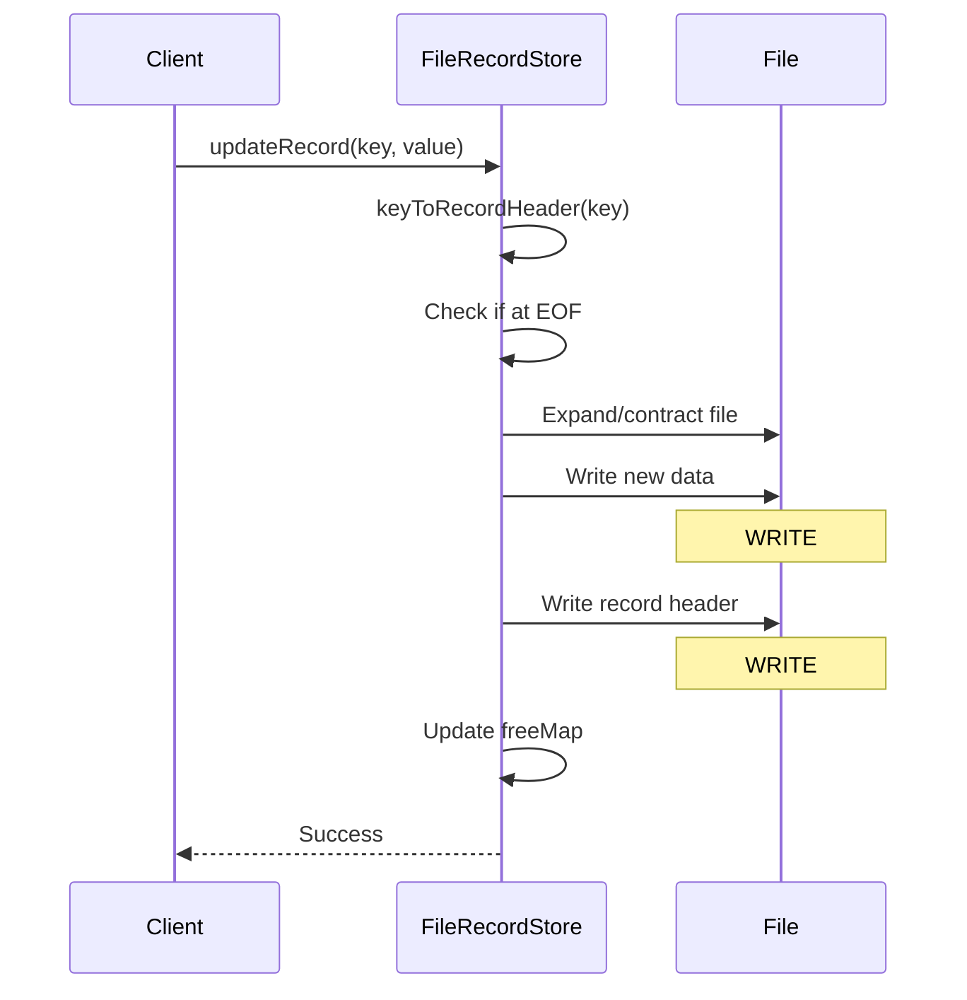

**Steps**:
1. Get existing RecordHeader from memIndex
2. Calculate end of record: `dataPointer + dataCapacity`
3. Check if `endOfRecord == getFileLength()` (record is last)
4. Update dataCount and dataCapacity to new size
5. Expand or contract file: `setFileLength(fileLength + (newSize - oldCapacity))`
6. **WRITE #1**: Write length + new data + CRC32 at dataPointer
7. **WRITE #2**: Write updated RecordHeader to index
8. Update freeMap

**Write Count**: 2 writes

---

### Update - Move Required (Grows)

**Scenario**: New data is larger, must allocate new space and move the record.

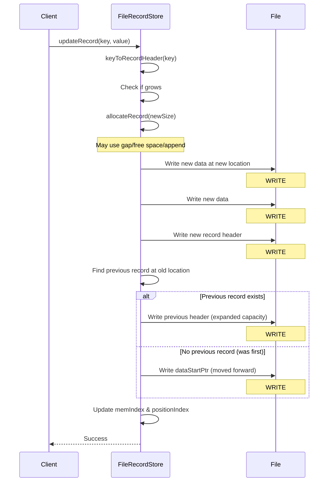

**Steps**:
1. Get existing RecordHeader from memIndex
2. Check if `value.length > header.dataCapacity`
3. Call allocateRecord(value.length) to find/create new space
   - This may allocate from gap (1 write), free space (1 write), or append (0 writes)
4. **WRITE #1-2**: Writes from allocate step (0-2 writes depending on method)
5. **WRITE #3**: Write length + new data + CRC32 at new location
6. **WRITE #4**: Write new RecordHeader to index
7. Update memIndex and positionIndex to point to new location
8. Handle old space - find previous record at `oldDataPointer - 1`:
   - If previous record exists:
     - Increment its dataCapacity by old record's capacity
     - **WRITE #5**: Write updated previous header (coalesce free space)
   - If no previous (was first record):
     - **WRITE #5**: Write dataStartPtr moved forward to skip freed space
9. Update freeMap

**Write Count**: 5-6 writes (depending on allocation method)

---

## DELETE Operations

### Delete - Last Record

**Scenario**: Deleting the record at the end of the file, can shrink file.

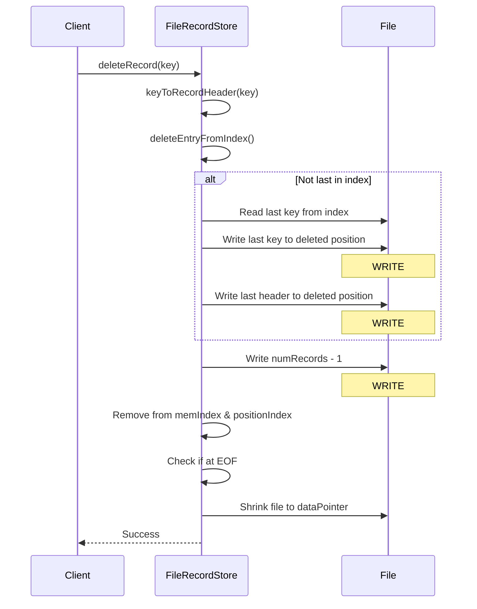

**Steps**:
1. Get RecordHeader for key from memIndex
2. Call `deleteEntryFromIndex(header, currentNumRecords)`:
   - If not last in index (indexPosition != numRecords - 1):
     - Read last key from index
     - Get last header from memIndex
     - Update last header's indexPosition to deleted position
     - **WRITE #1**: Write last key to deleted index position
     - **WRITE #2**: Write last header to deleted index position
   - **WRITE #3**: Write numRecords - 1
3. Remove from memIndex and positionIndex
4. Remove from freeMap
5. Check if record is at EOF: `fileLength == dataPointer + dataCapacity`
6. Shrink file: `setFileLength(dataPointer)` (no write, just truncate)

**Write Count**: 1-3 writes (1 if last in index, 3 if not)

---

### Delete - Middle Record with Previous

**Scenario**: Deleting a record in the middle, merge free space with previous record.

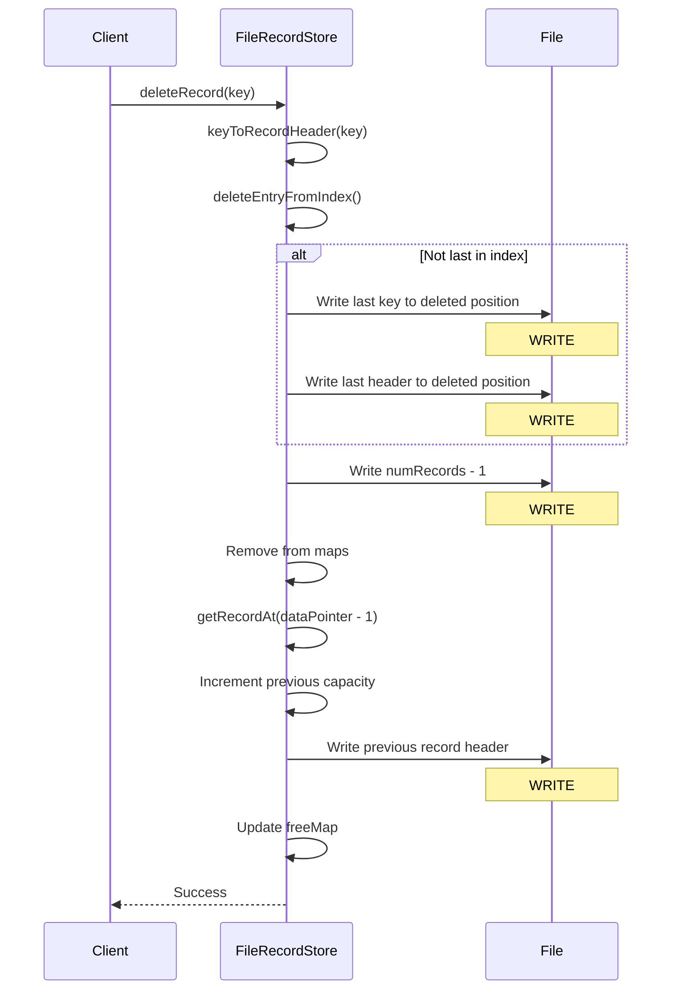

**Steps**:
1. Get RecordHeader for key
2. Delete entry from index (0-2 writes, see above)
3. **WRITE #3**: Write numRecords - 1
4. Remove from memIndex, positionIndex, and freeMap
5. Not at EOF, so check for previous record at `dataPointer - 1`
6. Find previous record using positionIndex.floorEntry()
7. Increment previous record's dataCapacity by deleted record's capacity
8. **WRITE #4**: Write updated previous header
9. Update freeMap with previous record's new free space

**Write Count**: 2-4 writes (depending on index position)

---

### Delete - First Record (No Previous)

**Scenario**: Deleting the first record in data region, update dataStartPtr.

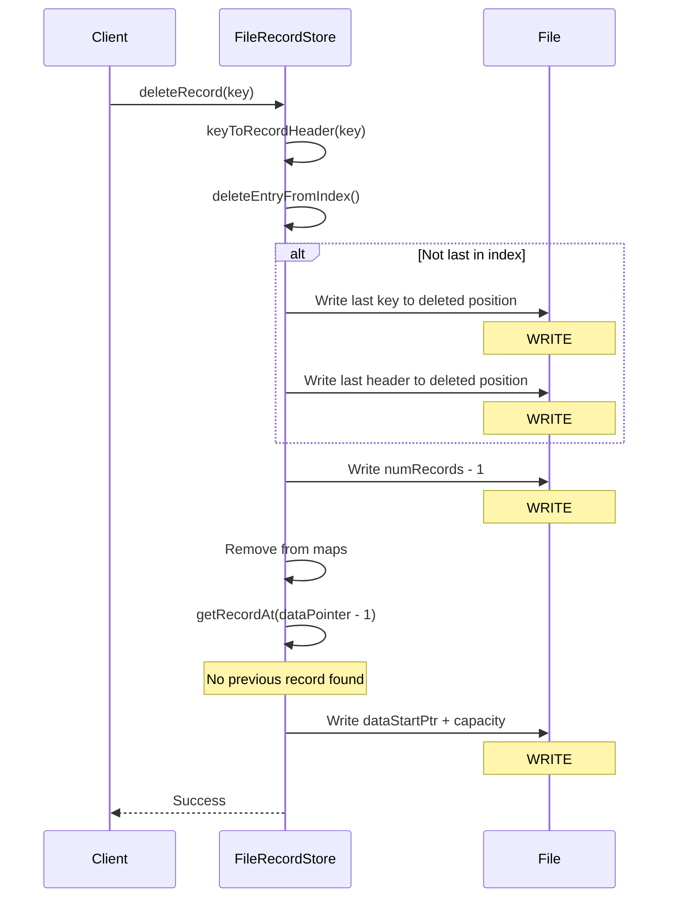

**Steps**:
1. Get RecordHeader for key
2. Delete entry from index (0-2 writes)
3. **WRITE #3**: Write numRecords - 1
4. Remove from memIndex, positionIndex, and freeMap
5. Not at EOF, search for previous record at `dataPointer - 1`
6. No previous record found (this was first data record)
7. **WRITE #4**: Write dataStartPtr advanced by deleted capacity: `dataPointer + dataCapacity`
8. This creates free space at end of index region

**Write Count**: 2-4 writes (depending on index position)

---

## Write Count Summary

| Operation | Scenario | Write Count |
|-----------|----------|-------------|
| **INSERT** | Gap available | 5 |
| **INSERT** | Free space reuse | 5 |
| **INSERT** | Append to end | 4 |
| **INSERT** | Index expansion (N records moved) | 3N + 4 |
| **UPDATE** | In place (same size) | 3 |
| **UPDATE** | In place (smaller, CRC) | 3 |
| **UPDATE** | Last record resize | 2 |
| **UPDATE** | Move required (grows) | 5-6 |
| **DELETE** | Last record | 1-3 |
| **DELETE** | Middle (with previous) | 2-4 |
| **DELETE** | First record (no previous) | 2-4 |

## Analysis and Issues

### Current Problems

1. **Write Amplification**: Most operations require 3-5 writes minimum
2. **Multiple Seeks**: Each write may be at a different file location
3. **Index Expansion Cost**: Worst case 3N+4 writes when moving N records
4. **Complex Free Space Management**: ConcurrentSkipListMap requires sorting and scanning
5. **In-Place Overwrites**: Suboptimal for SSD wear leveling
6. **No Write Batching**: Each operation completes all writes synchronously

### Micro-Optimizations Currently Used

1. **PAD_DATA_TO_KEY_LENGTH**: Pad records to avoid frequent index expansions
2. **CRC32 for Crash Safety**: Dual writes of headers enable crash recovery
3. **Free Space Sorting**: ConcurrentSkipListMap for O(log n) iteration
4. **Index Preallocation**: Initial size hint reduces early expansions
5. **Gap Allocation**: Try to use space between index and data first

### Requirements for SSD-Optimized Approach

Based on the analysis above, an SSD-optimized append-only design should:

1. **Eliminate In-Place Updates**: Never seek backwards to overwrite
2. **Always Append**: All writes go to end of file (sequential I/O)
3. **Simplify Bookkeeping**: Replace freeMap with single totalFreeSpace counter
4. **Remove Space Reuse**: Don't search for gaps, just append
5. **Large Slab Allocation**: Preallocate large chunks (100MB+)
6. **Periodic Compaction**: Background copy collection when free space exceeds threshold
7. **Version Counter**: Two-file approach with version for crash recovery
8. **Reduce Write Count**: Target 2 writes per operation vs 3-5 currently

