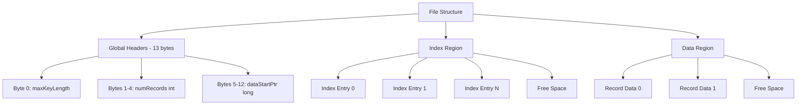
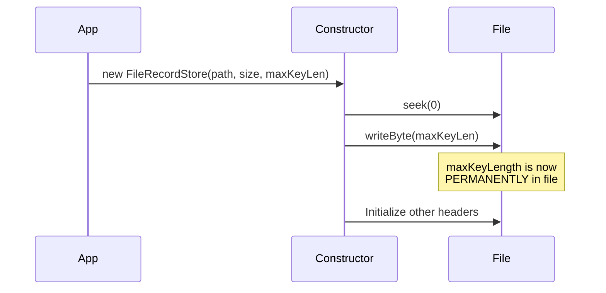
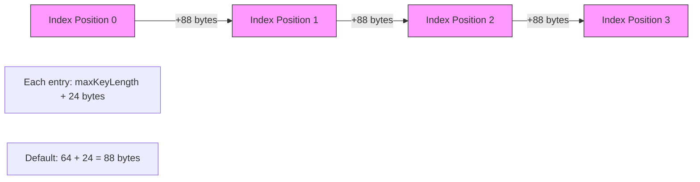
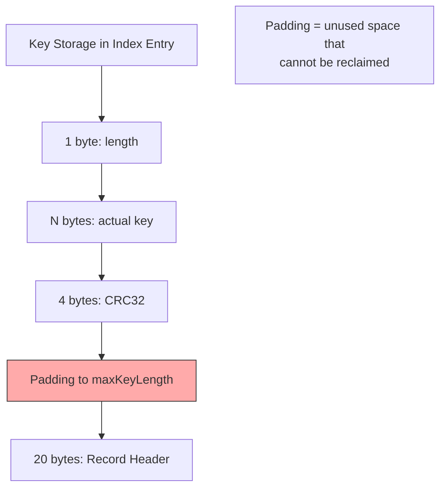
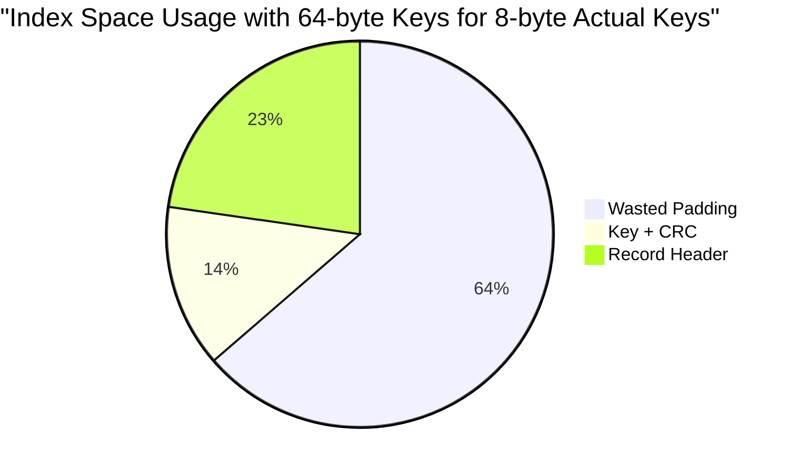
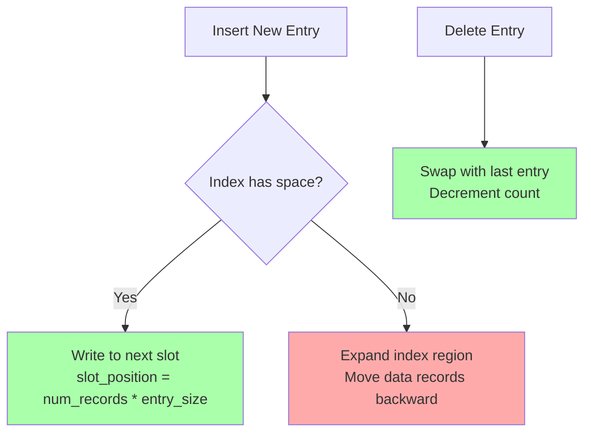
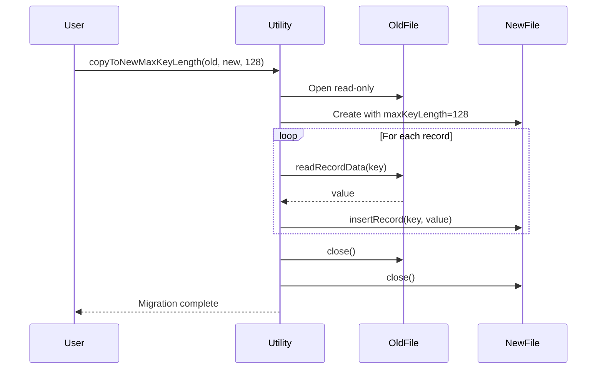
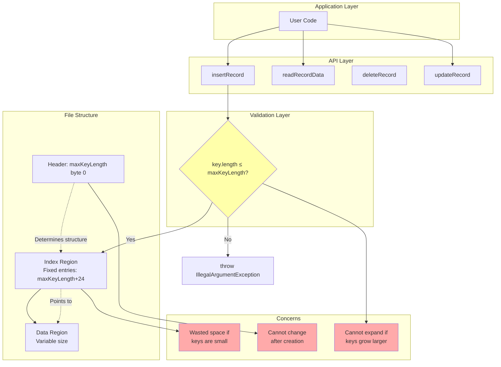

# MAX_KEY_SIZE Analysis

## Executive Summary

The `maxKeyLength` is a critical configuration parameter that is **permanently burned into the file format** upon creation. This document analyzes where it's used, the implications of this design decision, and potential solutions for the concerns raised in the issue.

## Issue Context

The issue raises two main concerns:
1. **Default may be oversized for small keys**: The default 64-byte key length may waste space if users have small keys (e.g., UUID strings at 36 bytes)
2. **Users may need to expand it later**: If a user starts with the default and later needs larger keys, they're stuck

## File Format Overview

The Simple Record Store uses a single file with a fixed header containing the max key length:



### Index Entry Structure

Each index entry has a **fixed size** determined by `maxKeyLength`:

```
indexEntryLength = maxKeyLength + 4 (CRC32) + 20 (RecordHeader)
```

Structure of one index entry:
```
┌─────────────────────────────────────────────────────────────┐
│  Key Data (variable, up to maxKeyLength bytes)              │
│  - 1 byte: actual key length                                │
│  - N bytes: key data (N ≤ maxKeyLength - 1)                 │
│  - 4 bytes: CRC32 of key                                    │
├─────────────────────────────────────────────────────────────┤
│  Record Header (20 bytes fixed)                             │
│  - 8 bytes: dataPointer (long)                              │
│  - 4 bytes: dataCapacity (int)                              │
│  - 4 bytes: dataCount (int)                                 │
│  - 4 bytes: CRC32 of header (int)                           │
└─────────────────────────────────────────────────────────────┘
Total: maxKeyLength + 4 + 20 bytes
```

## Where MAX_KEY_SIZE is Used

### 1. File Creation and Loading

**Location**: `FileRecordStore.java` lines 41-46, 115-134, 152-184

```java
// Default and theoretical max
public static final int DEFAULT_MAX_KEY_LENGTH = 64;
public static final int MAX_KEY_LENGTH_THEORETICAL = 252; // 2^8 - 4

// Written to file on creation (line 130)
private void writeKeyLengthHeader() throws IOException {
    file.seek(0);
    val keyLength = (byte) maxKeyLength;
    file.write(keyLength);
}

// Read from file when opening (lines 161-163)
file.seek(0);
val b = file.readByte();
this.maxKeyLength = b & 0xFF;
```

**Implications**:
- The value is stored as a **single byte** at position 0
- Maximum possible value is **252 bytes** (256 - 4 for CRC32)
- Once written, this value determines the index structure forever



### 2. Index Entry Size Calculation

**Location**: `FileRecordStore.java` lines 58, 119-120, 164-165, 580-590

```java
private final int indexEntryLength;

// Calculated in constructor
this.indexEntryLength = maxKeyLength + Integer.BYTES + RECORD_HEADER_LENGTH;
// = maxKeyLength + 4 (CRC32) + 20 (header) = maxKeyLength + 24

// Used to calculate file positions
private long indexPositionToKeyFp(int pos) {
    return FILE_HEADERS_REGION_LENGTH + (indexEntryLength * pos);
}

private long indexPositionToRecordHeaderFp(int pos) {
    return indexPositionToKeyFp(pos) + maxKeyLength;
}
```

**Implications**:
- Every index entry occupies `maxKeyLength + 24` bytes regardless of actual key size
- With default 64-byte keys: each entry is 88 bytes
- With minimal UUID keys (36 bytes): each entry would be 60 bytes
- **Space waste for small keys**: 32% overhead (28 bytes wasted per entry) for UUIDs with default settings



### 3. Key Validation on Insert

**Location**: `FileRecordStore.java` lines 383-390

```java
private void addEntryToIndex(ByteSequence key, RecordHeader newRecord,
                             int currentNumRecords) throws IOException {
    if (key.length() > maxKeyLength) {
        throw new IllegalArgumentException(
            String.format("Key of len %d is larger than permitted max size of %d bytes. " +
                "You can increase this to %d using env var or system property %s.MAX_KEY_LENGTH",
                key.length(), maxKeyLength, MAX_KEY_LENGTH_THEORETICAL,
                FileRecordStore.class.getName()));
    }
    // ... proceed with insert
}
```

**Implications**:
- Hard rejection of keys exceeding `maxKeyLength`
- No runtime flexibility once file is created
- Error message misleadingly suggests changing property, but that only works for **new** files

### 4. Key Reading/Writing

**Location**: `FileRecordStore.java` lines 592-616, 621-660

```java
private void writeKeyToIndex(ByteSequence key, int index) throws IOException {
    val len = (byte) key.length();
    val writeLen = (int) key.length() + 1 + CRC32_LENGTH;
    
    ByteBuffer buffer = ByteBuffer.allocate(writeLen);
    buffer.put(len);
    buffer.put(key.bytes, 0, (int) key.length());
    // ... write CRC32
    
    val fpk = indexPositionToKeyFp(index);
    file.seek(fpk);
    file.write(array, 0, writeLen);
}

private ByteSequence readKeyFromIndex(int position) throws IOException {
    val fp = indexPositionToKeyFp(position);
    file.seek(fp);
    
    int len = file.readByte() & 0xFF;
    assert len <= maxKeyLength;
    
    byte[] key = new byte[len];
    file.read(key);
    // ... validate CRC32
}
```

**Implications**:
- Actual key storage is variable length (1 byte length + key + 4 byte CRC)
- But space is reserved up to `maxKeyLength`
- Remainder is **unused padding** within the fixed index entry



### 5. Configuration and Defaults

**Location**: `FileRecordStore.java` lines 186-202

```java
public static String MAX_KEY_LENGTH_PROPERTY = "MAX_KEY_LENGTH";

static int getMaxKeyLengthOrDefault() {
    final String key = String.format("%s.%s", 
        FileRecordStore.class.getName(), MAX_KEY_LENGTH_PROPERTY);
    String keyLength = System.getenv(key) == null
            ? Integer.valueOf(DEFAULT_MAX_KEY_LENGTH).toString()
            : System.getenv(key);
    keyLength = System.getProperty(key, keyLength);
    return Integer.parseInt(keyLength);
}
```

**Usage in constructors**:
```java
// Constructor for new file with default
public FileRecordStore(String dbPath, int initialSize) throws IOException {
    this(dbPath, initialSize, getMaxKeyLengthOrDefault(), false);
}

// Constructor for new file with explicit value
public FileRecordStore(String dbPath, int initialSize, int maxKeyLength, 
                      boolean disableCrc32) throws IOException {
    // ... maxKeyLength is burned into file here
}
```

**Implications**:
- Configuration only applies when creating **NEW** files
- Environment variable: `com.github.trex_paxos.srs.FileRecordStore.MAX_KEY_LENGTH`
- System property: `-Dcom.github.trex_paxos.srs.FileRecordStore.MAX_KEY_LENGTH=36`
- No effect on existing files - they use stored value

## Space Utilization Analysis

### Scenario 1: UUID String Keys (36 bytes)

With **default** 64-byte max:
```
Index entry size = 64 + 24 = 88 bytes
Actual key data = 1 + 36 + 4 = 41 bytes
Wasted per entry = 88 - 41 - 20 = 27 bytes (30.7% waste)

For 10,000 entries:
Total index size = 880,000 bytes (859 KB)
Wasted space = 270,000 bytes (264 KB)
```

With **optimal** 36-byte max:
```
Index entry size = 36 + 24 = 60 bytes
Actual key data = 1 + 36 + 4 = 41 bytes
Wasted per entry = 60 - 41 - 20 = -1 bytes (needs padding to 41)
Actually: 60 bytes total (no waste)

For 10,000 entries:
Total index size = 600,000 bytes (586 KB)
Space saved = 280,000 bytes (273 KB) - 31.8% reduction
```

### Scenario 2: SHA-256 Hash Keys (32 bytes)

With **default** 64-byte max:
```
Index entry size = 88 bytes
Wasted per entry = 32 bytes (36.4% waste)

For 100,000 entries:
Total index size = 8,800,000 bytes (8.4 MB)
Wasted space = 3,200,000 bytes (3.1 MB)
```

With **optimal** 32-byte max:
```
Index entry size = 56 bytes
For 100,000 entries:
Total index size = 5,600,000 bytes (5.3 MB)
Space saved = 3,200,000 bytes (3.1 MB) - 36.4% reduction
```

### Scenario 3: Small Integer Keys (8 bytes)

With **default** 64-byte max:
```
Index entry size = 88 bytes
Wasted per entry = 56 bytes (63.6% waste!)

For 1,000,000 entries:
Total index size = 88,000,000 bytes (84 MB)
Wasted space = 56,000,000 bytes (53 MB)
```

With **optimal** 8-byte max:
```
Index entry size = 32 bytes
For 1,000,000 entries:
Total index size = 32,000,000 bytes (30.5 MB)
Space saved = 56,000,000 bytes (53.4 MB) - 63.6% reduction
```



## Issue Analysis: Why is maxKeyLength Burned In?

The design makes `maxKeyLength` immutable because:

### 1. Fixed Index Entry Size Enables Fast Seeking

```java
// Direct calculation without reading file
private long indexPositionToKeyFp(int pos) {
    return FILE_HEADERS_REGION_LENGTH + (indexEntryLength * pos);
}
```

**Benefit**: O(1) random access to any index entry
**Cost**: Cannot change entry size without rewriting entire index

### 2. Simplifies Index Region Management

The code treats the index as a contiguous array:
- Growing: move data region forward
- Compacting: swap last entry to deleted slot



### 3. Crash Safety Through Atomic Operations

Fixed entry sizes allow atomic overwrites:
```java
// Deleting by swapping last entry (lines 462-475)
if (header.indexPosition != currentNumRecords - 1) {
    val lastKey = readKeyFromIndex(currentNumRecords - 1);
    RecordHeader last = keyToRecordHeader(lastKey);
    last.setIndexPosition(header.indexPosition);
    
    writeKeyToIndex(lastKey, last.indexPosition);  // Atomic overwrite
    writeRecordHeaderToIndex(last);                 // Atomic overwrite
}
writeNumRecordsHeader(currentNumRecords - 1);      // Atomic decrement
```

**If entries were variable size**: These operations would require complex multi-step rewrites that are harder to make crash-safe.

## Proposed Solutions

### Option 1: Document Current Behavior (Minimal)

**What to do**:
- Add clear documentation about `maxKeyLength` being permanent
- Provide guidance on choosing appropriate values
- Update error messages to clarify setting only works for new files

**Pros**:
- No code changes
- Maintains simplicity and performance
- Clear expectations

**Cons**:
- Doesn't solve the core problems
- Users still need to guess future requirements
- Migration still requires manual copying

**Implementation**: Update README and add warnings

### Option 2: Create a Copy Utility (Recommended)

**What to do**:
Create a utility method to copy data to a new store with different `maxKeyLength`:

```java
public static void copyToNewMaxKeyLength(String sourcePath, String destPath, 
                                        int newMaxKeyLength) throws IOException {
    try (FileRecordStore source = new FileRecordStore(sourcePath, "r", false);
         FileRecordStore dest = new FileRecordStore(destPath, source.size(), 
                                                    newMaxKeyLength, false)) {
        for (ByteSequence key : source.keys()) {
            byte[] value = source.readRecordData(key);
            dest.insertRecord(key, value);
        }
    }
}
```

**Pros**:
- Enables migration when needed
- Can also compact files (remove free space)
- Maintains crash safety of original design
- Simple implementation

**Cons**:
- Requires disk space for duplicate file
- Downtime during copy
- Not instant

**Use cases**:
1. User realizes default is oversized: copy to smaller
2. User needs larger keys: copy to bigger
3. Maintenance: compact fragmented file



### Option 3: Variable-Length Index Entries (Not Recommended)

**What to do**:
Redesign file format to support variable index entry sizes.

**Pros**:
- Optimal space usage
- No padding waste
- Dynamic sizing

**Cons**:
- **Major breaking change** to file format
- Loss of O(1) index access
- Much more complex code
- Harder to ensure crash safety
- Violates "simple" goal of project
- Backward incompatible

**Verdict**: This fundamentally conflicts with the design goals stated in README:
> "Is simple. It doesn't use or create background threads. It doesn't use multiple files."

### Option 4: Multiple Key Size Tiers with Auto-Migration

**What to do**:
Pre-define size tiers (8, 16, 32, 64, 128, 256) and auto-migrate when needed.

**Cons**:
- Complex
- Unexpected I/O during operations
- Not "simple"
- Could fail mid-migration

**Verdict**: Against project philosophy

### Option 5: Provide Size Analysis Tool

**What to do**:
Add a utility to analyze existing keys and recommend optimal size:

```java
public static void analyzeKeySize(String filePath) throws IOException {
    try (FileRecordStore store = new FileRecordStore(filePath, "r", false)) {
        int current = store.maxKeyLength;
        int min = 0, max = 0, total = 0, count = 0;
        
        for (ByteSequence key : store.keys()) {
            int len = key.length();
            min = count == 0 ? len : Math.min(min, len);
            max = Math.max(max, len);
            total += len;
            count++;
        }
        
        int avg = count > 0 ? total / count : 0;
        int recommended = ((max + 7) / 8) * 8; // Round up to multiple of 8
        
        System.out.printf("Current maxKeyLength: %d%n", current);
        System.out.printf("Key sizes - min: %d, max: %d, avg: %d%n", min, max, avg);
        System.out.printf("Recommended maxKeyLength: %d%n", recommended);
        
        int currentWaste = (current + 24) * count;
        int optimalWaste = (recommended + 24) * count;
        int actualUsed = (total + count + count * 4 + count * 20); // len + keys + crcs + headers
        
        System.out.printf("Current index size: %d KB%n", currentWaste / 1024);
        System.out.printf("Optimal index size: %d KB%n", optimalWaste / 1024);
        System.out.printf("Potential savings: %d KB (%.1f%%)%n", 
            (currentWaste - optimalWaste) / 1024,
            100.0 * (currentWaste - optimalWaste) / currentWaste);
    }
}
```

**Pros**:
- Helps users make informed decisions
- No risk
- Educational

**Cons**:
- Doesn't solve the problem, just illuminates it

## Recommended Solution: Hybrid Approach

Implement **Options 1, 2, and 5** together:

### 1. Enhanced Documentation
Add to README.md:
```markdown
### Choosing MAX_KEY_LENGTH

⚠️ **Important**: The maximum key length is permanently written to the file 
when created. It cannot be changed later without copying all data to a new file.

Guidelines:
- Measure your actual key sizes before creating the store
- Add 10-20% headroom for future needs
- Consider trade-off: larger = more wasted space, smaller = less flexibility
- Use `FileRecordStore.analyzeKeySize()` to analyze existing files

Common key types:
- Small integers (8 bytes): set to 8-16
- UUIDs as strings (36 bytes): set to 40-48
- SHA-256 hashes (32 bytes): set to 32-40
- Default (64 bytes): safe for most use cases
- Maximum supported: 252 bytes
```

### 2. Migration Utility
Add to `FileRecordStore`:
```java
/**
 * Copies all records from source file to a new file with different maxKeyLength.
 * Can also be used to compact a file by removing free space.
 * 
 * @param sourcePath Path to existing store
 * @param destPath Path for new store (must not exist)
 * @param newMaxKeyLength New maximum key length (8-252)
 * @throws IOException if files cannot be accessed or if any key exceeds newMaxKeyLength
 */
public static void copyToNewMaxKeyLength(String sourcePath, String destPath, 
                                        int newMaxKeyLength) throws IOException
```

### 3. Analysis Tool
Add to `FileRecordStore.main()`:
```java
if ("analyze".equals(command)) {
    analyzeKeySize(filename);
    return;
}
if ("copy".equals(command) && args.length >= 4) {
    int newMaxKeyLength = Integer.parseInt(args[3]);
    copyToNewMaxKeyLength(filename, args[2], newMaxKeyLength);
    return;
}
```

Usage:
```bash
java -jar simple-record-store.jar mydata.db analyze
java -jar simple-record-store.jar mydata.db copy mydata-new.db 48
```

## Mermaid: Complete Data Flow with Key Size Concerns



## Conclusion

The `maxKeyLength` parameter is a fundamental design choice that prioritizes:
1. **Simplicity**: Fixed-size entries = simple code
2. **Performance**: O(1) index access
3. **Safety**: Easy to make operations atomic

The trade-offs are:
1. **Inflexibility**: Cannot change after creation
2. **Space waste**: Padding for small keys
3. **Migration burden**: Manual copy required to resize

### Recommendations:

**For Users**:
1. Measure your key sizes before creating a store
2. Set `maxKeyLength` explicitly via constructor or property
3. Use the analysis tool before deciding to migrate
4. Use the copy utility when migration is needed

**For Maintainers**:
1. Implement the copy utility (Option 2) - highest value/effort ratio
2. Add the analysis tool (Option 5) - helps users make informed choices
3. Improve documentation (Option 1) - prevents future confusion
4. **Do not** change to variable-size entries - conflicts with design goals

The current design is **intentional and sound** for a "simple" record store. The concerns in the issue are valid but best addressed through tooling and documentation rather than fundamental redesign.
