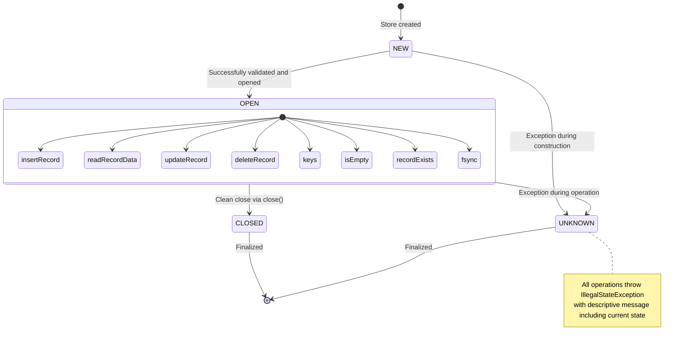
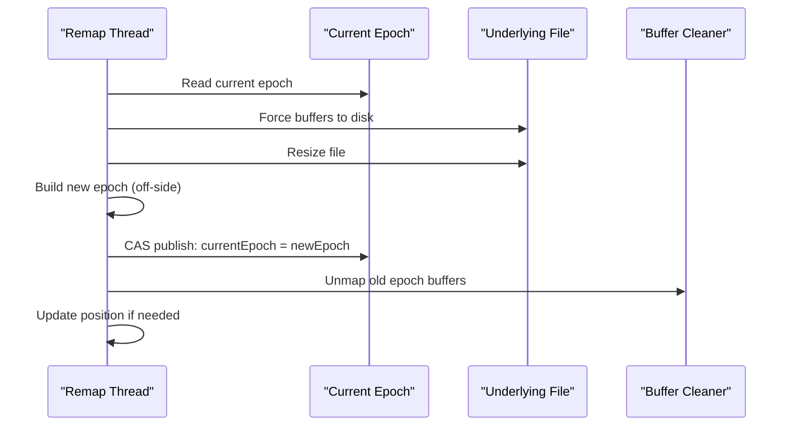
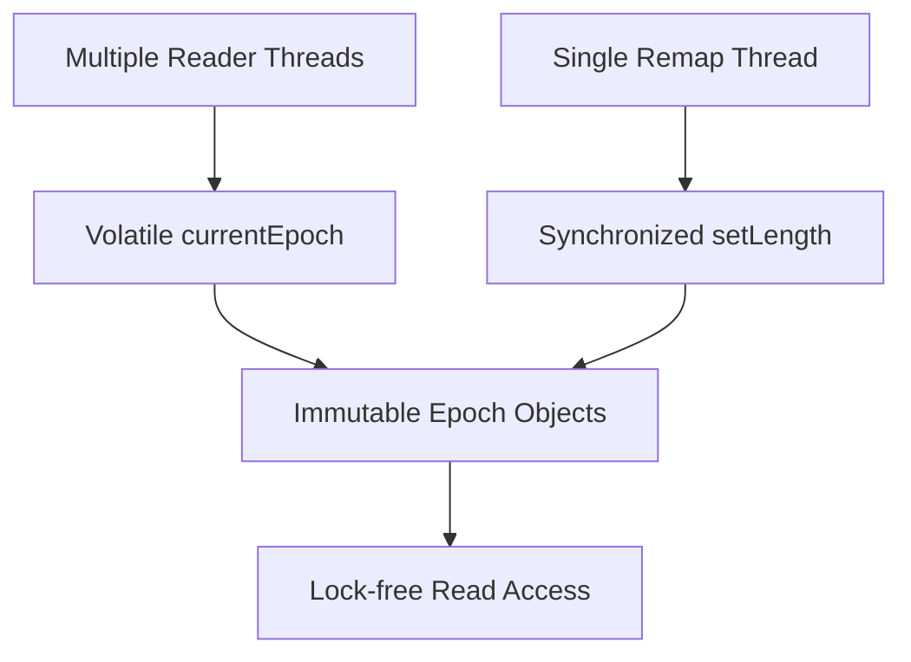

# Simple Record Store

Simple Record Store is a pure Java persistent hash table with a predefined maximum key length. Records are written into 
a single file. All keys must fit into the heap, but all values are offloaded onto disk. The order of writes is 
carefully arranged so that crashes will not corrupt the state of the data on disk. The project has no runtime 
dependencies beyond the Java base module.  

## Using

The latest release on Maven Central is:

```xml
<dependency>
	<groupId>com.github.trex-paxos</groupId>
	<artifactId>simple-record-store</artifactId>
	<version>1.0.0-RC6</version>
</dependency>
```

See `SimpleRecordStoreApiTests.java` for examples of the minimal public API. 

The public API uses a `ByteSequence` as the key. This is a lightweight wrapper to a byte array that implements `equals` 
and `hashCode`. This means that we know exactly how the store the keys on disk and can use it as the key of a Map: 

```java
    @Synchronized
    public boolean recordExists(ByteSequence key){}
```

This is discussed [here](https://stackoverflow.com/a/58923559/329496). You can either wrap a byte array or copy it: 

```java
    /*
     * This takes a defensive copy of the passed bytes. This should be used if the caller can recycle the array.
     */
    public static ByteSequence copyOf(byte[] bytes){}

    /*
     * This does not take a defensive copy of the passed bytes. This should be used only if you know that the array cannot be recycled.
     */
    public static ByteSequence of(byte[] bytes){}
```

An example of where you need to use `copyOf` would be where you are taking the bytes from a "direct" ByteBuffer where the 
array will be recycled. Examples of where you can safely use `of` to wrap the array would be where you asked a 
String to encode itself as a byte array using `getBytes`, which is always a fresh copy. Another example is where you serialise to 
generate a byte array, where you don't leak a reference to the array so that it won't be mutated. 

A problem with using `getBytes` on a string as a key is that the platform string encoding might change if you move the 
file around. To avoid that, there are a pair of methods that turn a string into a UTF8 encoded ByteSequence, which is a 
compact representation suitable for long-term disk storage:

```java
    /*
     * This encodes a string into a fresh UTF8 byte array wrapped as a ByteString. Note that this copies data.
     */
    public static ByteSequence stringToUtf8(String string){}

    /*
     * This decodes a UTF8 byte array wrapped in a ByteString into a string. Note that this copies data.
     */
    public static String utf8ToString(ByteSequence utf8){}
```

Note that the comments state that the `byte[]` is a copy, which is because `String` always copies data to be immutable.

There is `java.util.Logging` at `Level.FINE` that shows the keys and size of the data that is being inserted, 
updated, or deleted. If you find a bug, please try to create a repeatable test with fine logging enabled and post the
logging. There is additional logging at `Level.FINEST` that shows every byte written to or read from the file. 

## Memory-Mapped File Optimisation

Simple Record Store supports an optional **memory-mapped file** mode that reduces seek write costs while preserving all crash safety guarantees. This mode batches multiple write operations in memory and defers disk synchronisation.

### Benefits

- **Reduced Write Amplification**: Multiple writes are batched in memory instead of individual disk operations
- **Eliminated Seek Overhead**: All writes are memory accesses instead of disk seeks
- **Same Crash Safety**: Preserves dual-write patterns, CRC32 validation, and structural invariants
- **Drop-in Replacement**: No API changes, controlled via constructor parameter

### Usage

The recommended way to create a `FileRecordStore` is using the builder pattern:

```java
import java.nio.file.Paths;
import com.github.trex_paxos.srs.FileRecordStore;
import com.github.trex_paxos.srs.ByteSequence;

// Create new store with memory-mapping
FileRecordStore store = new FileRecordStore.Builder()
    .path(Paths.get("data.db"))
    .preallocatedRecords(10000)
    .maxKeyLength(64)
    .useMemoryMapping(true)
    .open();

// Open existing store
FileRecordStore store = new FileRecordStore.Builder()
    .path(Paths.get("data.db"))
    .open();

// Temporary store for unit testing
FileRecordStore store = new FileRecordStore.Builder()
    .tempFile("test-", ".db")
    .preallocatedRecords(1000)
    .open();
```

### Store State Management

The `FileRecordStore` uses an internal state machine to track its lifecycle and handle error conditions:



#### Store States:
- **NEW**: Initial state - store created but not yet validated/opened
- **OPEN**: Store successfully opened and operational - all methods available
- **CLOSED**: Store cleanly closed via `close()` method - no further operations allowed
- **UNKNOWN**: Store encountered an exception - all operations throw `IllegalStateException`

#### State Transitions:
- **Construction**: NEW → OPEN (success) or NEW → UNKNOWN (failure)
- **Operations**: OPEN → UNKNOWN (on any exception)
- **Cleanup**: Any state → CLOSED (via `close()`) or finalization

This state management ensures:
- Construction failures don't incorrectly mark stores as "closed"
- Operational exceptions properly prevent further operations
- Clear error messages indicate the actual state when operations are rejected
- Proper resource cleanup regardless of failure mode

Legacy constructor-based API (deprecated):
```java
// Create new store with memory-mapping
FileRecordStore store = new FileRecordStore("data.db", 10000, true);

// Open existing store with memory-mapping
FileRecordStore store = new FileRecordStore("data.db", "rw", true);

// Full control with all parameters
FileRecordStore store = new FileRecordStore(
    "data.db",           // path
    10000,               // initial size
    64,                  // max key length
    false,               // disable CRC32
    true                 // use memory mapping
);
```

### How It Works

Memory-mapped mode uses Java's `MappedByteBuffer` to map the file into memory:

1. **Write Operations**: All writes go to memory-mapped buffers instead of direct file I/O
2. **Flush Control**: Data is synchronized to disk only on `close()` or explicit `fsync()` calls
3. **Crash Safety**: The OS guarantees consistency of memory-mapped files; CRC32 validation catches corruption on read
4. **File Growth**: Automatically remaps when the file needs to expand

### Memory Requirements

**Key Fact**: Memory-mapped files do NOT need to fit entirely into RAM. The operating system uses demand paging:

- Only accessed portions of the file are loaded into memory (page fault handling)
- Unused pages can be evicted under memory pressure
- File size can exceed physical RAM + swap space
- The JVM address space limit (typically 2-4GB for 32-bit, much larger for 64-bit) is the theoretical maximum

**Chunked Mapping**: The implementation uses configurable chunks (default ~128MB) to:
- Reduce memory pressure for large files
- Enable partial unmapping when regions are no longer needed
- Provide atomic epoch-swap during file growth

**Memory Management**: 
- Native memory is explicitly released via buffer unmapping
- Failed remaps don't leak native memory
- Epoch-swap protocol ensures no orphaned buffers

### Crash Safety

Memory-mapped mode maintains the same crash safety guarantees as direct I/O:

- **Dual-Write Pattern**: Critical updates still write backup → data → final header
- **Header CRC32 Validation**: All headers includes CRC32 checksums validated on read
- **Optional Date CRC32 Validation**: Record data has CRC32 checksums validated on read which may be disabled
- **Structural Invariants**: File structure remains consistent after crashes
- **OS Guarantees**: The operating system ensures memory-mapped file consistency

The difference is in *when* writes reach disk:
- **Direct I/O**: Each write operation goes to disk when the OS chooses
- **Memory-Mapped**: Writes accumulate in memory; you can flush by calling `close()` or `sync()`

### When to Use Memory-Mapping

**Use memory-mapped mode when:**
- You have sufficient RAM to map the file
- You are happy to have deferred writes for throughput with only occasional calls to `sync()`

**Use direct I/O mode when:**
- You prefer simple traditional Java IO
- File size exceeds available RAM

### Performance Considerations

Memory-mapping reduces write cost. The actual performance gain depends on:

- **Workload**: Batch operations benefit more than single operations; update-heavy workloads see 40%+ time reduction
- **File Size**: Pre-allocating file space avoids remapping overhead; frequent file growth can be slower than direct I/O
- **OS Configuration**: Page cache and memory-mapped file limits affect performance
- **Hardware**: SSD vs HDD latency differences

**Best practices for optimal performance:**
- Pre-allocate file size using a large `initialSize` parameter to minimise remapping
- Use memory-mapping for update-heavy workloads where file size is stable
- Consider direct I/O if your workload involves frequent, small file size changes

### Native Memory Management

The implementation uses an **atomic epoch-swap protocol** to prevent native memory leaks:

1. **Epoch Structure**: Immutable containers holding mapped buffers and region boundaries
2. **Atomic Publishing**: New epochs are built off-side then atomically published
3. **Explicit Cleanup**: Old epoch buffers are explicitly unmapped after transition
4. **Fail-Closed Design**: Failed remaps leave current epoch unchanged

#### Epoch-Remap Process



#### Concurrency Model



The implementation ensures robust native memory management during file growth operations.

### Monitoring and Debugging

Monitor native memory usage with these commands:

```bash
# Monitor native memory usage
jcmd <pid> VM.native_memory summary

# Track mapped buffer count
jcmd <pid> GC.class_histogram | grep DirectByteBuffer
```

Enable detailed memory mapping logging:

```properties
# Enable detailed memory mapping logging
java.util.logging.config.file=logging.properties

# In logging.properties:
com.github.trex_paxos.srs.MemoryMappedRandomAccessFile.level = FINEST
```

## Thread Safety

`FileRecordStore` is **thread-safe** for single-process access:

- All public methods are synchronised using Lombok's `@Synchronized` annotation
- Multiple threads can safely share one `FileRecordStore` instance
- Callers require no additional locking
- Defensive copies are returned by methods like `keys()` to ensure thread safety

**Limitations**:

- **Not safe for concurrent multi-process access** - Multiple processes opening the same file will lead to data corruption
- If multiple processes need access, they must coordinate access externally (e.g., using file locks or a coordination service)
- The underlying `RandomAccessFile` is not designed for multi-process synchronisation

**Safe Backup Approaches**:

- For backups within the same process, use the `keys()` method to enumerate records and `readRecordData()` to read values
- Beware this can be slow as it will lock - we need a feature to move to a read-write lock to avoid this. 
- For external backups, ensure the store is closed or that no writes are occurring, then use standard file copying tools
- Consider using explicit `fsync()` before copying to ensure all data is flushed to disk

## Details

The original code was based on Derek Hamner's 1999 article [Use a RandomAccessFile to build a low-level database](http://www.javaworld.com/jw-01-1999/jw-01-step.html)
which shows how to create a simple key-value storage file. That code isn't safe under crashes due to the ordering 
of writes. This code base has tests that use a brute force search to throw exceptions on every file operation, then 
validate that the data on disk is always left in a consistent state. It also adds CRC32 checks to the data that are 
validated upon read from disk. **Note** If an IOException is thrown, it does _not_ mean that the write is known to have 
failed. It means that the write _may_ have failed and that the in-memory state *might* be inconsistent with what is on 
disk. The way to fix this is to close the store and open a fresh one to reload all the headers from disk. 

This implementation: 

1. It is simple. It doesn't use or create background threads. It doesn't use multiple files. As a result, it is ten times less Java bytecode when comparing total Jar sizes with true embedded database libraries. That means it is also ten times slower, as it does not batch writes to disk, unlike append-only writes. Instead, it does multiple writes to disk per operation. (Update: now we have memory-mapped files; this cost is somewhat mitigated.)
1. Defaults to prioritising safety over space, over speed. You can override some defaults if you are sure that your 
 read and write patterns allow you to. It is wise to use the defaults and only change them if you have tests that prove 
 safety and performance are not compromised. 
1. Supports a maximum key length of 247 bytes. The default is 64 bytes. 
1. Supports a maximum file of byte length Long.MAX_VALUE.
1. Supports a maximum of Integer.MAX_VALUE entries.
1. The maximum size of keys is fixed for the life of the store and is written to the file upon creation. 
1. Uses a `HashMap` to index record headers by key. 
1. Uses a `TreeMap` to index record headers by the offset of the record data within the file. 
1. Uses a `ConcurrentSkipList` to record which records have free space sorted by the size of the free space.  
1. Has no dependencies outside the JDK and uses `java.logging` aka JUL for logging.  
1. Is thread-safe. It uses an internal lock to protect all public methods. 
1. Uses an in-memory HashMap to cache record headers by key. A record header is the key and compact metadata, such as the  
offset, data and checksum. This makes locating a record by key an `O(1)` lookup.
1. Stores the key with a single byte length and CRC footer
1. The records are held in a single `RandomAccessFile` comprising: 
   1. A four-byte header, which is the number of records. 
   2. An index region, which is all the headers with possibly some free space at the end. The index region can be 
   pre-allocated when the store is first created. Once the index is filled up, fresh inserts will expand this region 
   by moving the records beyond it.  
   3. The data region. Past deletes or updates may have created free space between records. Record inserts or moves will 
   attempt to fill free space. If none is available, the file's length will be expanded. 
1. An insert:
   1. May cause the index region to expand to fix the new header. This is done by moving the records to the end of the file. 
   1. May insert the record into any free space between existing records that is large enough. 
   1. Else inserts the record at the end of the file, expanding as necessary.  
1. An update:
   1. May write in situ if the new record has the same length
   1. May write in situ if the new record is smaller and CRC32 checks are not disabled. Free space is created. 
   1. Will move the record if it has been expanded. The move creates free space at the old position.  
   1. May move to a big enough free space or expand the file as necessary.    
   1. Any free space created by a move follows the same rules as for deletion below. 
1. A delete:
   1. May shrink the file if it is the last record. 
   1. Else move the second record backwards if it is the first record (issue.
   1. Else will create some free space in the middle of the file, which is updated to the header of the previous record. 
   1. Will overwrite the deleted header by moving the last header over it, then decrementing the headers count, creating 
   free space at the end of the index space.    
1. Record headers contain a CRC32 checksum, which is checked when the data is loaded. If you write zip data that has a 
built-in CRC32, you can disable this in the constructor. So that you know, disabling CRC32 checks will prevent updates in situ when 
records shrink. In which case, the update with less data will write to a free location.  
1. The order of writes to the records is designed so that if there is a crash, there isn't any corruption. This is confirmed 
by the unit tests, which for every functional test record every file operation. The test then performs a brute force 
replay, crashing at every file operation and verifying the integrity of the data on disk after each crash. 

Note that the source code utilises Lombok to enable the writing of cleaner and safer code. This is a compile-time only dependency. 

## Crash-Safety Testing

Crash resilience is enforced by a replay harness that wraps every functional scenario in `SimpleRecordStoreTest`:

- `RecordsFileSimulatesDiskFailures` substitutes the production `RandomAccessFile` with an `InterceptedRandomAccessFile`, routing every I/O call through a `WriteCallback` hook.
- Each scenario first runs with a `StackCollectingWriteCallback`, capturing the precise sequence of file operations (stack traces are trimmed once execution exits `com.github.simbo1905`).
- The test then replays the same scenario once per recorded call, using a `CrashAtWriteCallback` to throw an `IOException` at that call index. This simulates a crash immediately after the intercepted disk operation.
- After the injected failure, the store is reopened using the standard `FileRecordStore`, iterating `keys()` and reading every value via `readRecordData`. That replay exercises the built-in `CRC32` guard while asserting that `getNumRecords()` matches the readable set, flagging any divergence as corruption.
- The harness runs across inserts, updates, deletes, compaction, and both narrow and padded payloads (see `string1k`) so every write ordering is brute-forced.

## Configuration

The file byte position is 64 bits, so thousands of petabytes. The maximum number of record values is 32 bits, so a maximum of 2.14 GB. 

You can set the following properties with either an environment variable or a `-D` flag. The `-D` flag takes precedence:

| Property                                                | Default | Comment                 |
|---------------------------------------------------------|---------|-------------------------|
| com.github.simbo1905.srs.BaseRecordStore.MAX_KEY_LENGTH | 64      | Max size of key string. |
| com.github.simbo1905.srs.BaseRecordStore.PAD_DATA_TO_KEY_LENGTH | true      | Pad data records to a minimum of RECORD_HEADER_LENGTH bytes. |

Note that the actual record header length is MAX_KEY_LENGTH + RECORD_HEADER_LENGTH. If you have UUID string keys and set the max key size to 36, then each record header will be 68 characters. The PAD_DATA_TO_KEY_LENGTH option is to avoid a write amplification effect when growing the index region. If your values are 8-byte longs keyed by UUID string keys, growing the index region to hold one more header would mean moving 9 values to the back of the file. The current logic doesn't batch that it would do x9 writes. If you preallocate the file, the index space shrinks rather than grows, so there is write amplification, and you can disable padding to save space. 

## Build

Build and test the code with: 

```shell script
mvn package
```

Release: 

```shell script
# do a snapshot release
mvn clean deploy

# do a dry run of the real release
mvn release:prepare -DdryRun=true

# clean the dry run
mvn release:clean

# make the actual tag 
mvn release:prepare 

# checkout and deply the tag
mvn release:perform
```

## Alternatives

Some notable pure Java alternatives that don't compromise on crash saftey are:

* [MapDB](http://www.mapdb.org) "provides Java Maps, Sets, Lists, Queues and other collections backed by off-heap 
or on-disk storage. It is a hybrid between java collection framework and embedded database engine." 
* [Xodus](https://github.com/JetBrains/xodus) "JetBrains Xodus is a transactional schema-less embedded database used by JetBrains YouTrack and JetBrains Hub."
* [MVStore](https://www.h2database.com/html/mvstore.html) "The MVStore is a persistent, log structured key-value store. It is used as default storage subsystem of H2, but it can also be used directly within an application, without using JDBC or SQL." 

As at Dec 2019 there are comments in the code of one of those projects that they need to add automated crash tests. This project has such tests. 

Their jar files are an order of magnitude bigger:

| Alternative  | Jar Size | Transient Deps |
| ------------- | ------------- | ------------- |
| simple-record-store 1.0.0-RC6  | 23 kB  | -  |
| mapdb 3.0.7  | 730 kB | 16 jars  |
| xodus-environment 1.3.124  | 502 kB | 3 jars  |
| h2-mvstore 1.4.200 | 301 kB | -  |

 They likely have a lot more than an order of magnitude more development effort put into them. As a result they are embedded database engines that work with variable length keys that don't fit in memory and that optimise the write path. That makes them very fast. 

## Performance

This [video](https://youtu.be/e1wbQPbFZdk) has a section that explains that you have to compromise between read speed, update speed, and memory. This implementation uses a standard `java.util.HashMap` for all reads. That means that keys must fit in memory but that reads are at the standard in-memory cost. In terms of memory other than the `HashMap` there is a `TreeMap` recording where records are in the file. The key to the `TreeMap` is a long and values are the keys to the `HashMap`. This means that memory usage should be low compared to the techniques in the video. Where this implementation takes a hit is in write performance. It does update in place with additional writes to ensure consistency during crashes. Running [simple-record-store-benchmarks](https://github.com/simbo1905/simple-record-store-benchmarks) shows that the alternatives named above are about 10x faster at writes. This implimentation is also trying to be simple which means a small jar but none of the sophistication needed to optimise the read path. 
