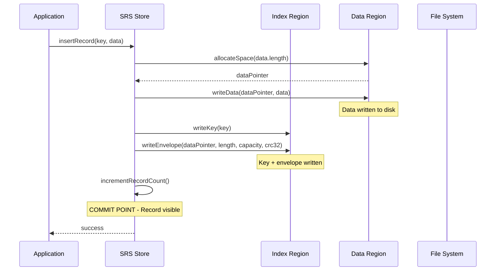
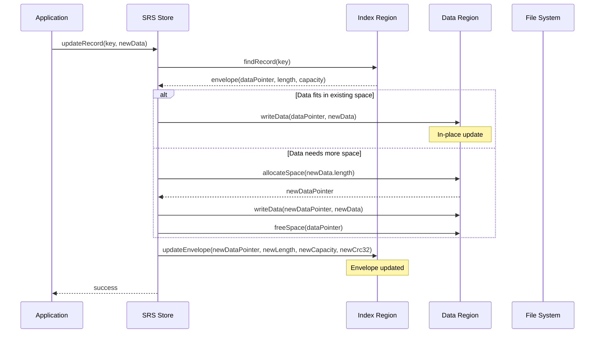
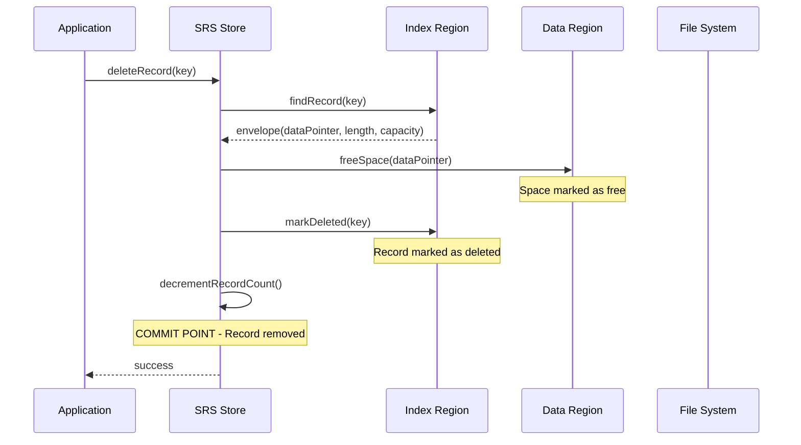
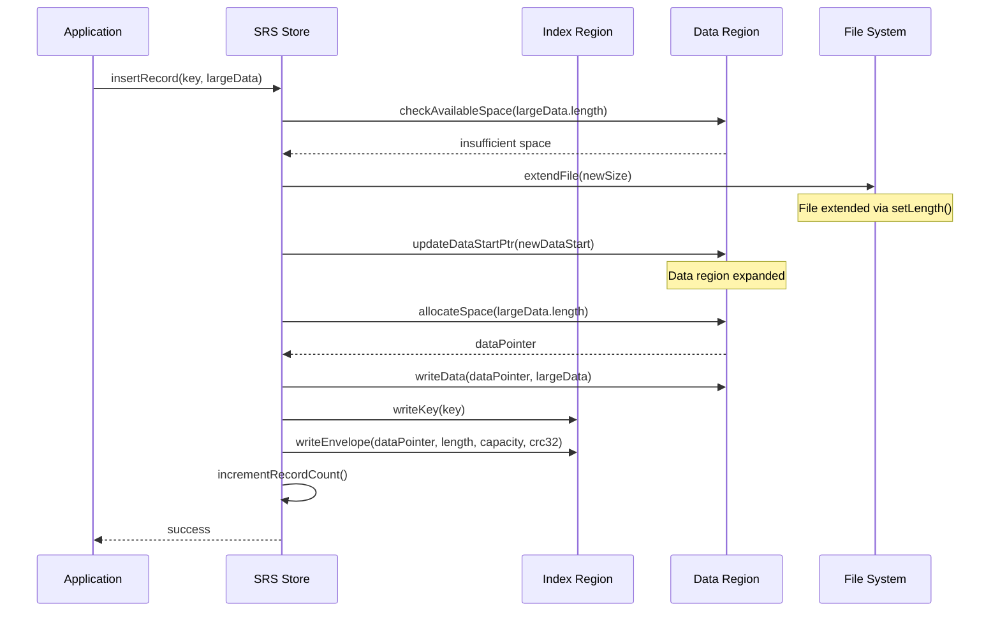
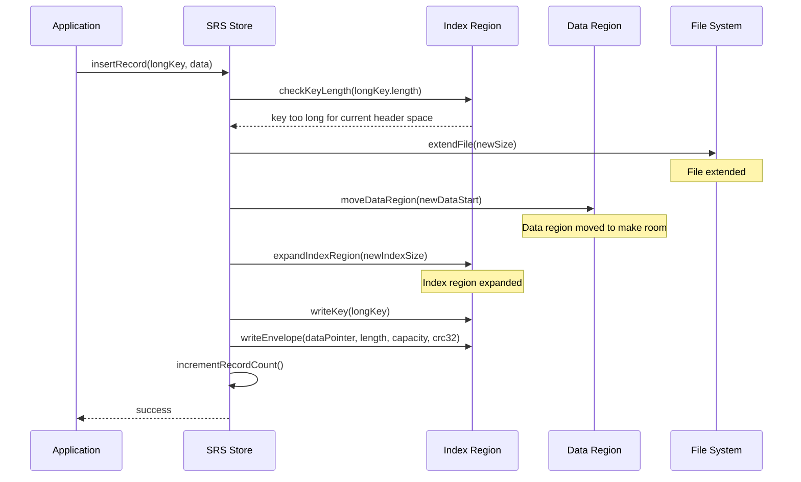
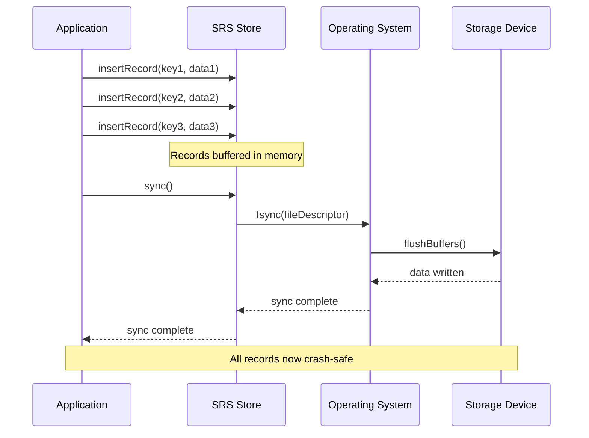
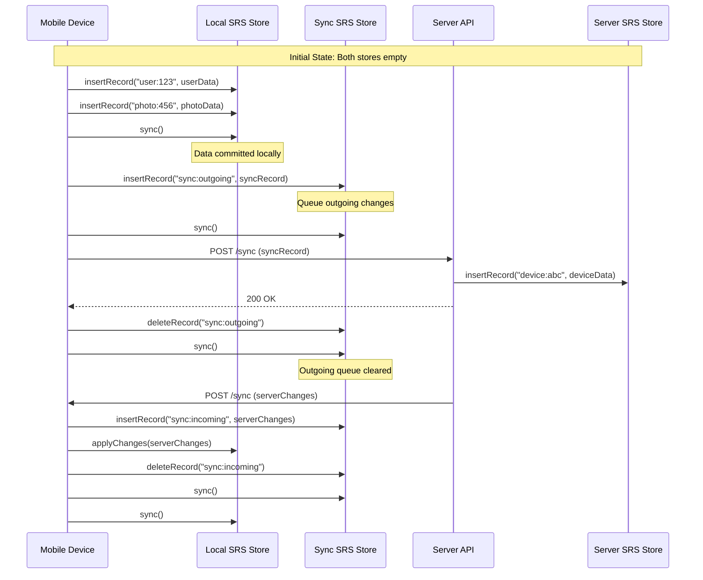
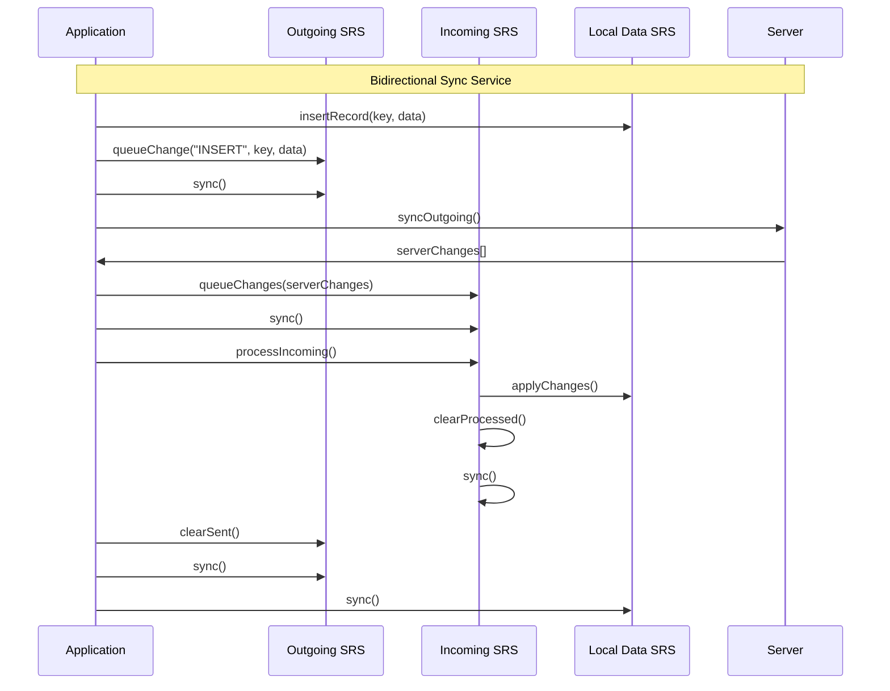

# Simple Record Store (SRS) Specification

A language-agnostic specification for a crash-safe, random-access record store with multiple storage backends.

## Overview

The Simple Record Store (SRS) is designed to provide crash-safe storage of key-value records with the following characteristics:

- **Crash Safety**: Survives power loss and system crashes
- **Random Access**: O(1) key-based record retrieval
- **Efficient Storage**: Minimal overhead with CRC32 validation
- **Platform Agnostic**: Works across Java, Dart, C++, and other languages
- **Scalable**: Supports files up to 2^63 bytes

## File Format Specification

### Header Structure (Fixed 18 bytes)

| Offset | Size | Field | Description |
|--------|------|-------|-------------|
| 0 | 4 | Magic | `0xBEEBBEEB` - File format identifier |
| 4 | 2 | Key Length | Maximum key length (1-32763 bytes) |
| 6 | 4 | Record Count | Number of active records |
| 10 | 8 | Data Start Ptr | File offset to start of data region |

### Index Region Structure

Each record in the index consists of:
- **Key**: Variable length (1 to Key Length bytes)
- **Envelope**: Fixed 20 bytes containing metadata

#### Envelope Structure (20 bytes)

| Offset | Size | Field | Description |
|--------|------|-------|-------------|
| 0 | 8 | Data Pointer | File offset to record data |
| 8 | 4 | Data Length | Length of record data |
| 12 | 4 | Data Capacity | Allocated space for record data |
| 16 | 4 | CRC32 | CRC32 checksum of key + envelope |

### Data Region Structure

Each record in the data region consists of:
- **Length Prefix**: 4 bytes (little-endian)
- **Data**: Variable length record payload
- **CRC32**: 4 bytes (optional, configurable)

## Crash Safety Guarantees

### Write Ordering Requirements

The implementation must ensure the following write order for crash safety:

1. **Record Insert**:
   - Write data to data region
   - Write key + envelope to index region
   - Increment record count (COMMIT POINT)

2. **Record Update**:
   - Write new data (in-place or new location)
   - Update envelope in index region
   - CRC32 validation on read

3. **Record Delete**:
   - Mark record as deleted in envelope
   - Decrement record count (COMMIT POINT)

### CRC32 Validation

- **Header CRC**: Always enabled, validates key + envelope integrity
- **Data CRC**: Optional, configurable per implementation
- **Recovery**: Invalid CRC indicates torn write, record is ignored

## Sequence Diagrams

### Record Insert Operation



### Record Update Operation



### Record Delete Operation



### Data Area Expansion



### Header Space Expansion



## Synchronization and Durability

### File Sync Requirements

The SRS specification requires applications to call `sync()` for crash durability:



### Single Writer Pattern

SRS is designed for single-writer scenarios where the application controls when data becomes durable:

- **Batch Operations**: Multiple inserts/updates before sync
- **Transaction-like**: Group related operations
- **Performance**: Reduce sync overhead
- **Crash Safety**: All-or-nothing durability

## FIFO Sync Service Pattern

### Server Synchronization Architecture

The SRS can be used to implement a robust server synchronization service:



### Bidirectional Sync Implementation



### Sync Service Benefits

1. **Crash Safety**: Both local and sync operations survive crashes
2. **Resumable**: Sync can resume from any point
3. **Ordered**: FIFO queue ensures proper operation ordering
4. **Efficient**: Batch operations reduce network overhead
5. **Reliable**: CRC32 validation prevents corruption

## Implementation Requirements

### Language Agnostic Requirements

All implementations must:

1. **Follow the file format exactly** - Byte-for-byte compatibility
2. **Implement CRC32 validation** - Header CRC mandatory, data CRC optional
3. **Maintain write ordering** - Critical for crash safety
4. **Support file expansion** - Both data and header regions
5. **Provide sync() method** - For durability control
6. **Handle torn writes** - Invalid CRC indicates corruption

### Platform-Specific Optimizations

- **Java**: Memory-mapped files for performance
- **Dart**: Random access files with buffering
- **Mobile**: Platform-specific storage APIs
- **Embedded**: Minimal memory footprint

### Testing Requirements

- **Crash simulation** - Power loss during operations
- **CRC validation** - Corrupt data detection
- **File format** - Cross-platform compatibility
- **Performance** - Platform-specific benchmarks

## File Format Validation

### Magic Number Check
```c
if (readUInt32(0) != 0xBEEBBEEB) {
    throw InvalidFormatException("Invalid magic number");
}
```

### Key Length Validation
```c
uint16_t keyLength = readUInt16(4);
if (keyLength < 1 || keyLength > 32763) {
    throw InvalidFormatException("Invalid key length");
}
```

### CRC32 Validation
```c
uint32_t computedCrc = crc32(key, keyLength);
computedCrc = crc32(computedCrc, envelope, 20);
if (computedCrc != readUInt32(envelopeOffset + 16)) {
    throw CorruptDataException("Invalid CRC32");
}
```

## Conclusion

The SRS specification provides a robust foundation for crash-safe record storage across multiple platforms. The language-agnostic design ensures interoperability while allowing platform-specific optimizations. The sync service pattern enables reliable server synchronization for mobile and distributed applications.