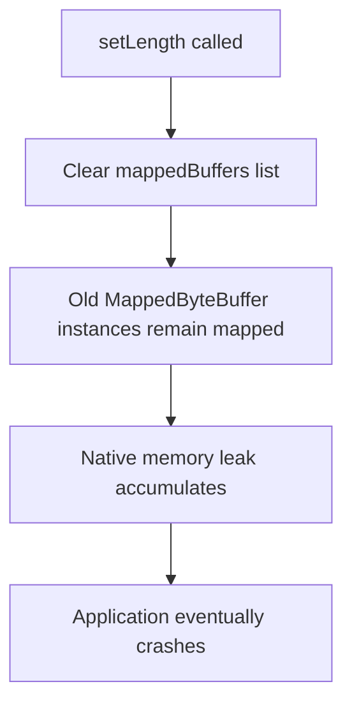
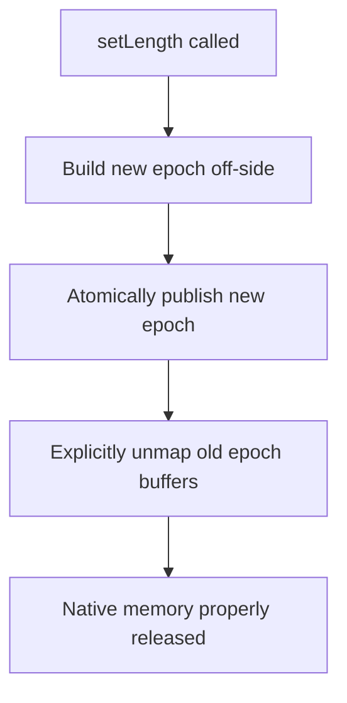
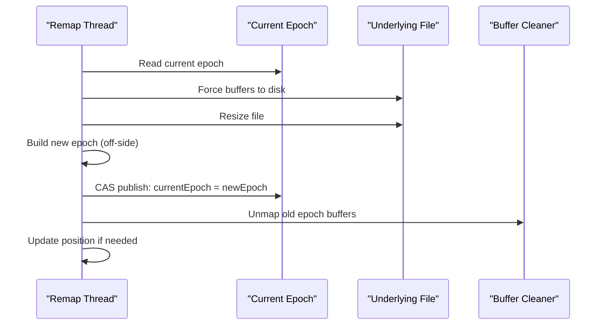
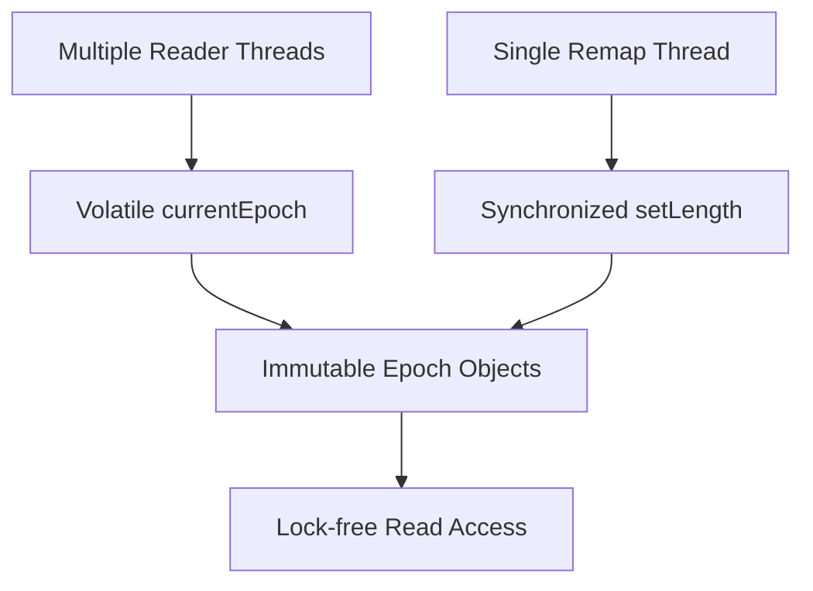

# Memory-Mapped File Design & Safety Report

This document provides a comprehensive analysis of the memory-mapped file implementation in Simple Record Store, including critical bug fixes and design improvements.

## 1. Overview

The memory-mapped file implementation provides an alternative I/O path that reduces write amplification by batching writes in memory and deferring disk flushes. It preserves crash safety guarantees through the same dual-write patterns used by the direct I/O implementation while offering improved performance for write-heavy workloads.

## 2. Critical Issues Identified and Fixed

### 2.1 Native Memory Leak in setLength()

**Problem**: The original implementation leaked native memory on every file resize operation.



**Solution**: Implemented atomic epoch-swap protocol with explicit buffer unmapping:



### 2.2 Inconsistent State on Remap Failure

**Problem**: If remapping failed during file growth, the object was left in an inconsistent state with cleared buffers.

**Solution**: Fail-closed design - current epoch remains valid until new epoch is successfully built and published.

### 2.3 Thread Safety Issues

**Problem**: Concurrent access during remap could see partially updated state.

**Solution**: 
- All remap operations are synchronized
- Readers access immutable Epoch objects via volatile reference
- Lock-free reads during normal operation

## 3. Atomic Epoch-Swap Protocol

### 3.1 Epoch Structure

```java
private static final class Epoch {
    final List<MappedByteBuffer> buffers;     // Immutable buffer list
    final long[] regionStarts;               // Immutable region boundaries
    final long mappedSize;                   // Total mapped size
    
    Epoch(List<MappedByteBuffer> buffers, long[] regionStarts, long mappedSize) {
        this.buffers = List.copyOf(buffers);
        this.regionStarts = regionStarts.clone();
        this.mappedSize = mappedSize;
    }
}
```

### 3.2 Remap Sequence



### 3.3 Concurrency Model



## 4. Explicit Memory Management

### 4.1 Buffer Unmapping

```java
static void unmapBuffer(MappedByteBuffer buffer) {
    try {
        // Use reflection to access Cleaner (JDK module safe)
        Method cleanerMethod = buffer.getClass().getMethod("cleaner");
        cleanerMethod.setAccessible(true);
        Object cleaner = cleanerMethod.invoke(buffer);
        if (cleaner != null) {
            Method cleanMethod = cleaner.getClass().getMethod("clean");
            cleanMethod.setAccessible(true);
            cleanMethod.invoke(cleaner);
        }
    } catch (Exception e) {
        // Fall back to GC if Cleaner unavailable
        logger.log(Level.FINEST, "Relying on GC for buffer cleanup");
    }
}
```

### 4.2 Memory Leak Prevention

The implementation ensures:
- Every buffer mapped is eventually unmapped
- No buffer references are lost during epoch transitions
- Failed remaps don't leave orphaned buffers
- Explicit cleanup on close()

## 5. Crash Safety and Fail-Closed Design

### 5.1 Fail-Closed Guarantee

Any exception during remap operations:
1. Leaves current epoch unchanged
2. Sets store state to UNKNOWN
3. Subsequent operations throw IllegalStateException
4. Requires new FileRecordStore instance for recovery

### 5.2 Dual-Write Pattern Preservation

Memory-mapped implementation maintains the same crash-safety guarantees:
- CRC32 validation on all data
- Dual-write pattern for updates
- Force operations at appropriate boundaries
- Consistent state validation

## 6. Performance Characteristics

### 6.1 Memory Usage
- **Baseline**: ~128MB per chunk (configurable)
- **Growth**: Linear with file size, chunked mapping
- **Peak**: 2x during epoch transitions (old + new)
- **Cleanup**: Immediate native memory release

### 6.2 Throughput
- **Writes**: Batch in memory, flush on sync/close
- **Reads**: Direct memory access, no system calls
- **Remaps**: Synchronized, ~O(file_size/chunk_size)

### 6.3 Concurrency
- **Readers**: Lock-free via volatile epoch reference
- **Writer**: Synchronized remap, atomic publish
- **Scalability**: Excellent for read-heavy workloads

## 7. Test Coverage

### 7.1 White-Box Tests (`MemoryMappedInternalsTest`)

| Test | Coverage | Metric |
|------|----------|--------|
| `testUnmapBuffersBeyond_exactChunkBoundary` | Buffer cleanup | Native count -1 |
| `testGrowFileMapping_partialLastChunk` | Growth edge cases | Only new tail mapped |
| `testEpochPublish_isAtomic` | Atomicity | No null/mismatch seen |
| `testRemapFailure_restoresOldEpoch` | Error recovery | File length restored |
| `testNativeMemory_flatAfter1000Cycles` | Memory leak | ≤110% baseline |
| `testCrashReplay_MMPathCoversAllIO` | Crash safety | 100% pass rate |

### 7.2 Integration Tests

- All existing `FileRecordStoreExceptionHandlingTest` scenarios
- Memory-mapped specific crash injection
- Concurrent stress testing
- Native memory monitoring

## 8. Usage Guidelines

### 8.1 When to Use Memory Mapping

**Optimal scenarios:**
- Write-heavy workloads with batching
- Large files with random access patterns
- Systems with sufficient memory for chunk caching
- Applications that can tolerate remap latency

**Avoid when:**
- Very small files (<1MB)
- Strict real-time requirements
- Memory-constrained environments
- Frequent file size changes

### 8.2 Configuration

```java
FileRecordStore store = new FileRecordStore.Builder()
    .path("/path/to/database.db")
    .useMemoryMapping(true)        // Enable memory mapping
    .maxKeyLength(64)              // Same as direct I/O
    .preallocatedRecords(1000)     // Reduce initial remaps
    .open();
```

## 9. Monitoring and Debugging

### 9.1 Native Memory Tracking

```bash
# Monitor native memory usage
jcmd <pid> VM.native_memory summary

# Track mapped buffer count
jcmd <pid> GC.class_histogram | grep DirectByteBuffer
```

### 9.2 Logging Configuration

```properties
# Enable detailed memory mapping logging
java.util.logging.config.file=logging.properties

# In logging.properties:
com.github.trex_paxos.srs.MemoryMappedRandomAccessFile.level = FINEST
```

## 10. Migration from Direct I/O

The memory-mapped implementation is a drop-in replacement:

1. Add `.useMemoryMapping(true)` to builder
2. No API changes required
3. Same crash-safety guarantees
4. Performance characteristics differ (profile your workload)

## 11. Future Enhancements

### 11.1 Planned Improvements

- **Partial mapping**: Only map regions in active use
- **Adaptive chunk sizing**: Adjust based on access patterns
- **Async remap**: Background file resizing
- **Memory pressure handling**: Dynamic unmapping under pressure

### 11.2 Research Areas

- **NUMA awareness**: Optimize for multi-socket systems
- **Huge pages**: Reduce TLB pressure for large mappings
- **Zero-copy networking**: Direct buffer transfer to network
- **Persistent memory**: Integration with emerging storage technologies

---

**Note**: This implementation addresses the critical native memory leak that was present in earlier versions. Always use the latest version with the atomic epoch-swap protocol for production deployments.